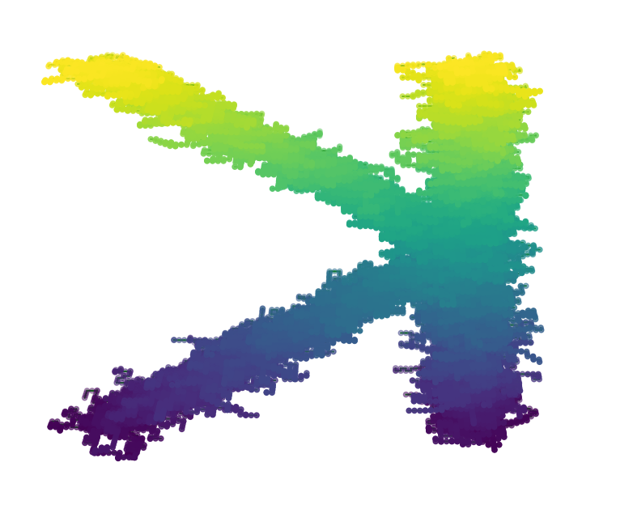

# KRW

## Introduction

KRW is a small coding project that creates randomly generated paths in 3d space.  These 3d distributions, or random walks, can be useful in material science.

## Photos

## Optimizations

</img>

Here, one instance of the program is running.  This snippet was taken while many random paths were being generated in parallel.  Parallelization can speed up simulations involving millions of calculations.

Another key optimization is the use of sets when graphically displaying points in matplotlib.  Without this optimization, large calculations are too slow to be usable.

